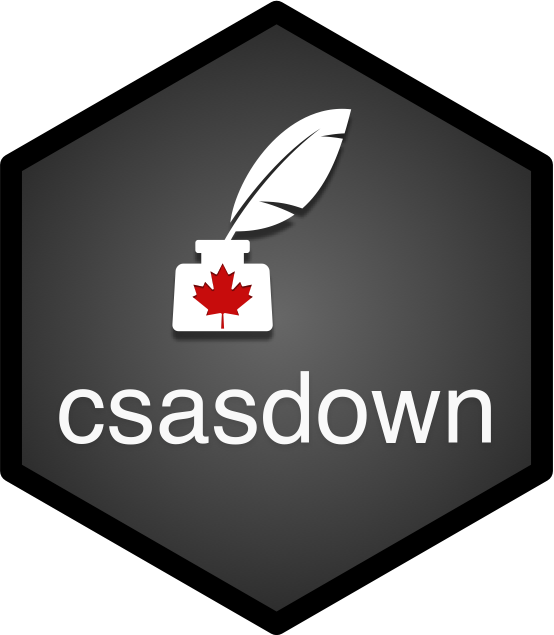
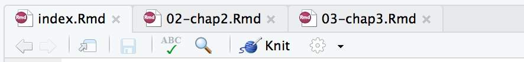
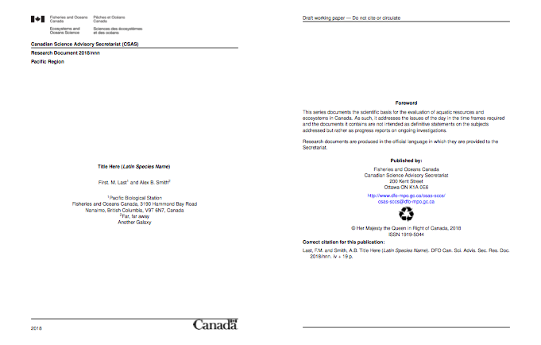
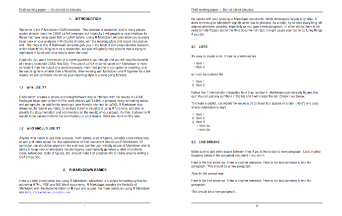

# csasdown 

> Reproducible CSAS Reports with R Markdown

<!-- badges: start -->
[](https://github.com/pbs-assess/csasdown/actions)
[](https://codecov.io/github/pbs-assess/csasdown?branch=main)
<!-- badges: end -->

csasdown is an R package for generating Canadian Science Advisory Secretariat (CSAS) documents in PDF or Word format using R Markdown and bookdown.

Check the [NEWS](https://github.com/pbs-assess/csasdown/blob/main/NEWS.md) file for information on what has changed recently.

Check the [Wiki](https://github.com/pbs-assess/csasdown/wiki) for hints and FAQs.

Have a problem? If it's a bug or feature request, please post it as a [GitHub Issue](https://github.com/pbs-assess/csasdown/issues). If it's a question on csasdown use, we encourage you to use the new GitHub [discussion board](https://github.com/pbs-assess/csasdown/discussions). Questions that are emailed or sent on MS Teams may be (anonymously and without data or screenshots) copied to the discussion board and answered there. Let us know if you don't want that to happen. For quick back-and-forth questions, you can catch us on [DFO MS Teams](https://teams.microsoft.com/l/channel/19%3ae15d7a8e776b418b8e4975a4c9c5f93f%40thread.skype/R%2520-%2520csasdown?groupId=50a32c0d-d5fe-4368-b95b-4beaaa1ba1a1&tenantId=1594fdae-a1d9-4405-915d-011467234338).

**If you use csasdown to write a report, please let us know so we can add it to the [list of publications](https://github.com/pbs-assess/csasdown/wiki/Publications-prepared-using-csasdown) known to have used the package. This helps us justify spending our work time on its development. You can post to the [discussion board](https://github.com/pbs-assess/csasdown/discussions), send us a quick email (contact details [here](https://github.com/pbs-assess/csasdown/blob/c76731e8580bb12da9324e56ff5e56a8d4901aeb/DESCRIPTION#L5-L8)), or find us on [DFO MS Teams](https://teams.microsoft.com/l/channel/19%3ae15d7a8e776b418b8e4975a4c9c5f93f%40thread.skype/R%2520-%2520csasdown?groupId=50a32c0d-d5fe-4368-b95b-4beaaa1ba1a1&tenantId=1594fdae-a1d9-4405-915d-011467234338).**

## Initial setup

To compile PDF documents using R, you need to have Pandoc, LaTeX, and several related packages installed. If you have a recent version of  [RStudio](http://www.rstudio.com/products/rstudio/download/), then you already have Pandoc.

1. You will need to install LaTeX if you do not have it already. Read [this Wiki page](https://github.com/pbs-assess/csasdown/wiki/Latex-Installation-for-csasdown) for a detailed description of this procedure. Most likely you will want to use the R package tinytex.

2. Install the csasdown package:

```r
install.packages("remotes")
remotes::install_github("pbs-assess/csasdown", dependencies = TRUE)
```

3. Create a new project in a new directory to hold your document project and all the files that csasdown creates. If you're using RStudio: click File -> New Project -> New Directory -> New Project, then type the name of the project in the **Directory name** box. Check the box **Open in new session**. If you are going to use GitHub version control (or if you are not sure), check the box **Create a git repository**. Click **Create Project**. A new RStudio project will open up, and will have its working directory set to the new document project's directory.

4. Run this line in your R console to create a new Research Document from the built-in template in whatever your working directory is:

```r
csasdown::draft("resdoc")
```

or for an advanced Research Document with bilingual features (in development):

```r
csasdown::draft("resdoc-b")
```

You can do the same for a Technical Report:

```r
csasdown::draft("techreport")
```

a Manuscript Report:

```r
csasdown::draft("manureport")
```


or for a Science Response:

```r
csasdown::draft("sr")
```

Note that the `techreport` and `manureport` examples contain a lot of information on getting started with R Markdown and should be the first one you render if you are new to `csasdown`. The `resdoc` example contains other examples.

The `resdoc-b` contains examples and guidance on setting up chunks to hold both English and French Rmarkdown, and explanations of the features introduced in version 0.1.0 (see the [NEWS](https://github.com/pbs-assess/csasdown/blob/main/NEWS.md) file).

5. Render the document right away to make sure everything works by opening the file **index.Rmd** and clicking the **knit** button in RStudio. Once completed, a preview pane showing the PDF document will appear. The location of the PDF is in the **_book** directory. See the *Rendering* section below for more information.

6. Read the output PDF carefully and compare with what is written in the .Rmd files. This will help you understand more quickly how the document is put together and how you might want to structure your document.

7. *(Optional but recommended)* Create a blank repository on GitHub, commit your changes, and push to GitHub. New to Git? Start with <https://happygitwithr.com/>.

8. Need to make an English *and* French version? csasdown has support for both. Also see csasdown's sibling package [rosettafish](https://github.com/pbs-assess/rosettafish).

## Publications prepared using csasdown

A list of the publications can be found on this [wiki page](https://github.com/pbs-assess/csasdown/wiki/Publications-prepared-using-csasdown).

## Day-to-day writing

You need to edit the individual chapter R Markdown files to write your report. While writing, you should `git commit` your work frequently. For a gentle novice-friendly guide to getting starting with using Git with R and RStudio, see <http://happygitwithr.com/>.

## Rendering

***
**Rendering using the knit button**

To render your report into a PDF or Word document, open `index.Rmd` in RStudio and then click the **knit** button:



<br>
<br>

A message will appear telling you which language and document type is being rendered.

Every time you add something new, you should render the document to make sure you didn't break the build. It is much easier to find the problem when only one small known change was made since the last time it was rendered. 


To change the output formats between PDF and Word find the following chunk of code in `index.Rmd` and change it to either `pdf` or `word`.

Like this:

```
output:
 csasdown::resdoc_pdf:
   french: false
```

or this:

```
output:
 csasdown::resdoc_word:
   french: false
```

To render other types of *csasdown* documents, replace `resdoc_pdf` and `resdoc_word` with `sr_pdf`, `sr_word`, `manureport_pdf`, `manureport_word`, `techreport_pdf`, or `techreport_word`.

***
**Rendering using the console**

You can also render from the console if you're not using RStudio or to allow debugging of your code.

To do this, you must have your working directory (see `getwd()`) be the one with the `index.Rmd` file and `_bookdown.yml` files in it.  Then run:

```r
csasdown::render()
```
or, for a detailed explanation of each step in the rendering process:

```r
csasdown::render(verbose = TRUE)
```

This method of rendering allows you to debug your code by inserting `browser()` calls which stops compilation at specific places.

*Note that you'll need to run `sink()` in the console once it stops on your `browser()` calls to see any variable values.*

It also does *not* open a preview viewer once finished like the knit button method does, so you will have to navigate to the `_book/` directory and open it up manually.

The rendered PDF or Word file of your report will be deposited in the `_book/` directory.





<!--
If you want to add a CSAS-formatted .docx title page to a Res Doc, edit the file `templates/RES2016-eng-titlepage.docx` as desired and run the command:

```r
csasdown::add_resdoc_docx_titlepage()
```

This will attach the title page to the beginning of the Word document.
-->

## Components

[Project structure in the Bookdown document:](https://bookdown.org/yihui/rmarkdown/bookdown-project.html)

The following components are ones you should edit to customize your report:

### `_bookdown.yml`

This is the main configuration file for your report. It determines what `.Rmd` files are included in the output, and in what order. Arrange the order of your chapters in this file and ensure that the names match the names in your folders. If you add new `.Rmd` files, add them here. You may comment out some files while working on others by placing a `#` in front of them. This will stop compilation of those files, reducing the time to compile while working on another file.

A temporary copy of this file is created when running `render()`. It is the file that is actually used in the rendering process. 
If you want to see what it holds, render with this command: `render(keep_files = TRUE)` to keep it around after rendering.

### `index.Rmd`

This file contains all the meta information that goes at the beginning of your document. You'll need to edit this to put your name on the first page, add the title of your report, etc. **The name of this file cannot be changed.**

A temporary copy of this file is created when running `render()`. It is the file that is actually used in the rendering process. 
If you want to see what it holds, render with this command: `render(keep_files = TRUE)` to keep it around after rendering.

### `01-chap1.Rmd`, `02-chap2.Rmd`, etc.

These are the .Rmd files for each chapter/section of your report. Write your report in these. You can delete any or all of these and create as many of your own as you wish, but if you do you must change the **_bookdown.yml** file accordingly.

Temporary copies of these file are created when running `render()`. They are the files that are actually used in the rendering process. 
If you want to see what they hold, render with this command: `render(keep_files = TRUE)` to keep them around after rendering.

### `bib/`

Store your bibliography (as BibTeX files) here. You might look at the [citr addin](https://github.com/crsh/citr) and [Zotero](https://www.zotero.org/) to efficiently manage and insert citations.

### `csl/`

Style files for bibliographies should be stored here. You will want to use the included `csas.csl`, which is based on the CJFAS (Canadian Journal of Fisheries and Aquatic Sciences) `.csl` file.

### `figure/` and `data/`

Store pre-made figures and data here and reference them in your R Markdown files. See the [bookdown book](https://bookdown.org/yihui/bookdown/) for details on cross-referencing items using R Markdown.

### `templates/`

This contains any `.docx` or `.tex` files that are need to compile the documents. With the exception of the title page file, you shouldn't have to edit any of these files.

## Related projects

This project has drawn directly on code and ideas from the following:

- <https://github.com/benmarwick/huskydown>
- <https://github.com/ismayc/thesisdown>

[NAFOdown](https://github.com/nafc-assess/NAFOdown) is a derivative of csasdown for rendering NAFO (Northwest Atlantic Fisheries Organization) reports.

## Contributing

If you would like to contribute to this project, please start by reading our [Guide to Contributing](CONTRIBUTING.md). Please note that this project is released with a [Contributor Code of Conduct](CONDUCT.md). By participating in this project you agree to abide by its terms.
